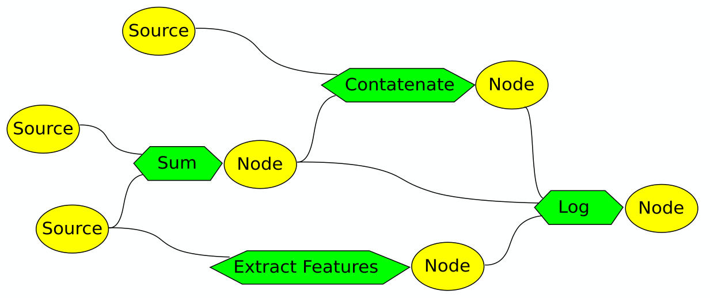

# DynamicFlow


The code quality is kept tracked by [SonarCloud](https://sonarcloud.io/summary/new_code?id=andreacasalino_DynamicFlow).

**DynamicFlow** is a templatized library for handling **data flow network**.
[**Data flow network**](https://en.wikipedia.org/wiki/Data-flow_diagram) are **data flow** having group of variables connected in a directed acyclic graph, whose values are correlated.
Each node of the network contains a value that is obtained by applying a certain specified function to the values previously computed for to the ancestors nodes.
This architecture can be used to model network of variables whose computation absorb a significant amount of time, like rendering engine, machine learning pipeline, long text handling, etc...



The interfaces contained in this repository allows you to create and handle the entities of the network, re-setting at the proper time the sources.
Then, you can subsequently update the entire network, re-computing only the nodes that were dependent by the updated sources.

Creating the sources can be easily done on this way:

```cpp
#include <flow/Flow.h>
using namespace flw;

// build a new flow
flw::Flow flow;

// define the sources nodes
auto source01 = flow.makeSource<int>("Source01");
auto source02 = flow.makeSource<std::string>("Source02");
```

Then, at least a node should be created by combining some sources or other nodes:

```cpp
// define a node obtained by combining the 2 sources
auto node = flow.makeNode<std::string>(
    "Node",
    // here you define the function used to combine the values of the
    // ancestors
    std::function<std::string(const int &, const std::string &)>(
        [](const int &source01_value, const std::string &source02_value) {
          std::string result =
              source02_value + std::to_string(source01_value);
          return "";
        }),
    // here you pass the ancestors
    source01, source02);
```

You can then update the sources in order to later recompute the node value:
```cpp
  // update the sources passing their new values (they should be unique
  // pointers)
  flow.updateSources(source01.getName(), std::make_unique<int>(2),
                     source02.getName(),
                     std::make_unique<std::string>("hello"));

  // update the entire flow
  flow.updateFlow();
```

You can also update single source one at a time:
```cpp 
flow.updateSources(source01.getName(), std::make_unique<int>(2));
flow.updateSources(source02.getName(),
                    std::make_unique<std::string>("hello"));
// update the entire flow
flow.updateFlow();
```

The functionalities provided are completely thread-safe (by the way feel free to report any bug if you discover a strange behaviour ;)).
Moreover, this package is already embedded with the functionality to update the flow by exploiting **multi threading**. From the outside, only the number of threads to use must be specified.

**Contents**

 * the cores functionalities and sources are contained in ./src
 * ./samples contains 3 classes of examples, extensively showing how to use dynamic flow

**Compile**
   
 * Configure and generate the project using [CMake](https://cmake.org)

   * check this [tutorial](https://www.youtube.com/watch?v=LxHV-KNEG3k) (it is valid for any kind of IDE and not only VS) if you are not familiar
   * When setting the CMake LIB_OPT flag to ON, the libraries that are part of this project will be compiled as shared, otherwise as static. 
	  
 * Compile the library and the samples

 * You can also just download the compiled binaries (compiled in Release) of the library of the latest master commit [here](https://github.com/andreacasalino/DynamicFlow/actions) 
 
**What else?**

If you have found this library useful, please find the time to leave a star :).
